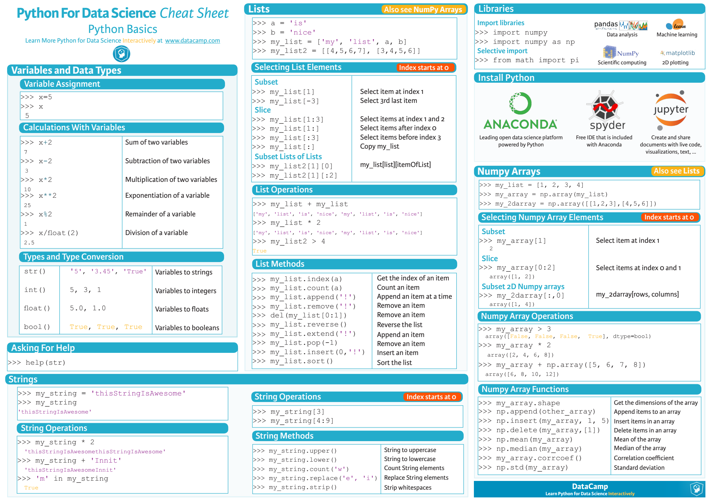
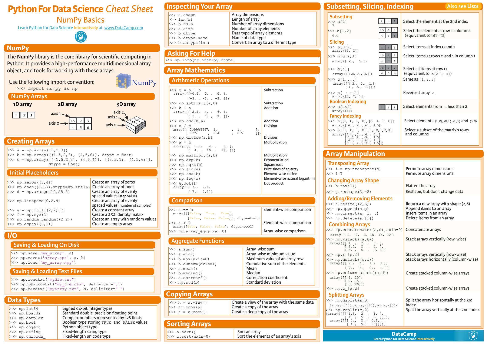
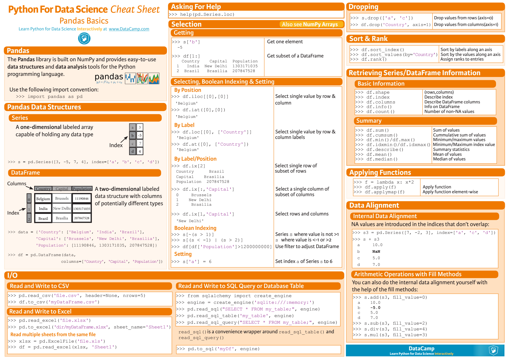
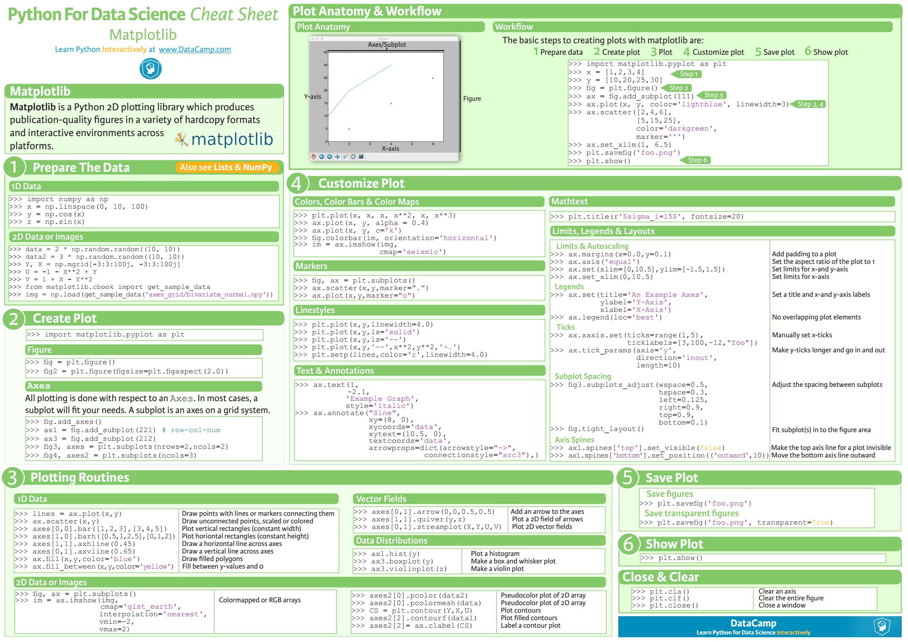

## How to use Python Interpreter.  
* Interactive Mode  
```shell
$ python
```
```python
>>> print('Hello, world!')
Hello, world!
```
* Non-Argument Mode  
```python
print('Hello, world!')
```
* Argument Mode  
```python
import sys

if __name__ == '__main__':
    if(len(sys.argv) > 1):
        print('Hello, ' + sys.argv[1])
```
  
## How to use pip.  
```shell
$ python3 -m pip install flask  
```
```shell
$ python3 -m pip uninstall flask  
```
* A Flask Demo.
```python
from flask import Flask  

app = Flask(__name__)  

@app.route('/')  
def hello():  
    return 'Hello, world!\n' 

app.run() 
```
  
## Python Tutorial. 
* [Built-in Types](https://docs.python.org/3/library/stdtypes.html)  
* [Control Flow](https://docs.python.org/3/tutorial/controlflow.html) 
* [Function](https://docs.python.org/3/tutorial/controlflow.html#defining-functions)  
* [Module](https://docs.python.org/3/tutorial/modules.html)  
* [Input & Output](https://docs.python.org/3/tutorial/inputoutput.html)  
* [Error & Exception](https://docs.python.org/3/tutorial/errors.html)    
* [Class](https://docs.python.org/3/tutorial/classes.html)  
* [Standard Library](https://docs.python.org/3/tutorial/stdlib.html)   
<div align="center">  
  <br><br>  
</div>  
  
## Useful Python Modules for Finance Data Analysis.  
* [numpy](https://docs.scipy.org/doc/numpy-dev/user/quickstart.html)    
<div align="center">  
  <br><br>  
</div>  

* [pandas](http://pandas.pydata.org/pandas-docs/stable/)  
<div align="center">  
  <br><br>  
</div>  

* [matplotlib](https://matplotlib.org/contents.html)    
<div align="center">  
  <br><br>  
</div>  

## Homework.
* Write a python script to calculate and draw the 5/10/30 MA line of [Citigroup Inc.](https://finance.yahoo.com/quote/c?p=c)'s stock price in NYSE.
